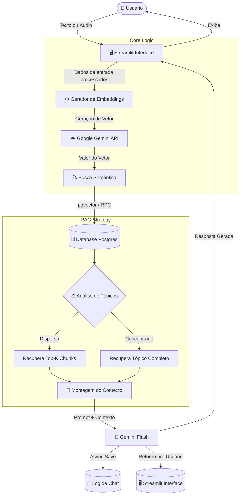
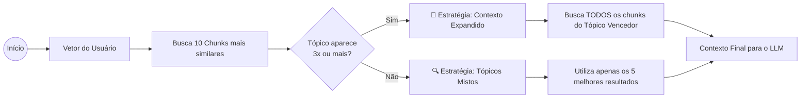
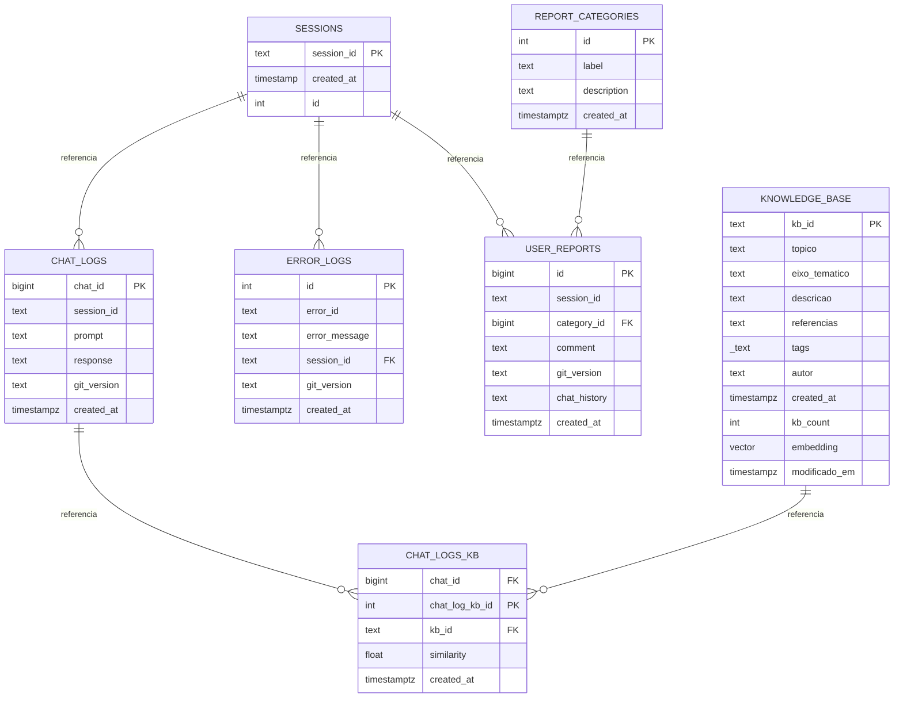

# 🏗️ Arquitetura de Dados e RAG no Vox AI

Este documento detalha a arquitetura técnica do Vox AI, com foco no fluxo de dados, esquema do banco de dados (Supabase) e na estratégia de recuperação de informação (RAG) inteligente.

## 🔄 Fluxo de Execução (Runtime Flow)

O diagrama abaixo ilustra o ciclo de vida de uma interação do usuário, desde a entrada do prompt até a geração da resposta e o log assíncrono.

## 🧠 Lógica de Recuperação Inteligente (Smart RAG)

O Vox utiliza o PostgreSQL com a extensão `pgvector` gerenciado pelo Supabase.

Abaixo estão as principais funções arquiteturais.

## 🗄️ Database Schema (ER Diagram)
O sistema utiliza Supabase (PostgreSQL) com as extensões `vector` e `pg_graphql`.
Abaixo, o diagrama de Entidade-Relacionamento das tabelas principais.

### Detalhe das Tabelas Principais
* `knowledge_base`: O núcleo do conhecimento. Utilizamos índices HNSW na coluna de embedding para performance em escala. Inclui a coluna `kb_count` incrementada via Trigger para métricas de utilidade.

* `chat_logs_kb`: Tabela pivot fundamental para auditoria. Ela conecta uma resposta da IA (`chat_logs`) aos fragmentos exatos de conhecimento (`kb_id`) que foram usados para gerá-la, permitindo rastrear a fonte de possíveis alucinações.

* `user_reports`: Conectada à tabela `report_categories`, permite que usuários classifiquem erros (ex: "Alucinação", "Ofensivo") para posterior análise da curadoria.

### Stack Tecnológica
* ***Orquestração***: Python 3.11 + Streamlit
* ***Vector Store***: Supabase (`pgvector`)
* ***LLM & Embeddings***: Google Gemini API (`gemini-1.5-flash` e `text-embedding-004`)
* ***CI/C***D: GitHub Actions (Deploy automático de Migrations e Code Review)

---

    
🤖 Vox AI: conversas que importam 🏳️‍🌈

