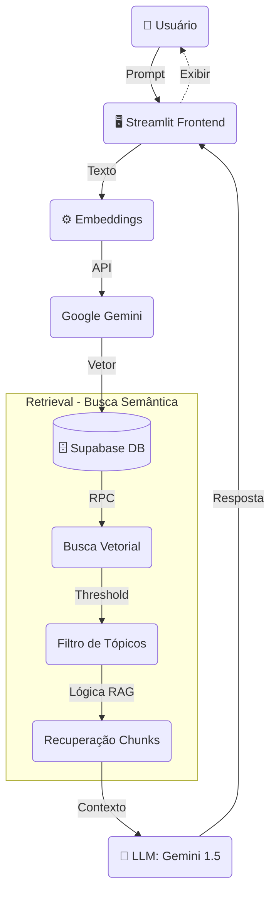

# 🏗️ Arquitetura de Dados e RAG - Vox AI

Este documento detalha a arquitetura técnica do **Vox AI**, com foco no fluxo de dados, esquema do banco de dados vetorial e estratégia de recuperação de informação (RAG).

## 🔄 Fluxo de Dados (Data Flow)

O diagrama abaixo ilustra o ciclo de vida de uma interação do usuário, desde a entrada do prompt até a geração da resposta enriquecida pelo contexto.

## 🗄️ Database Schema (Supabase/PostgreSQL)

O Vox utiliza o PostgreSQL com a extensão `pgvector` gerenciado pelo Supabase. Abaixo estão as principais tabelas e suas funções arquiteturais.

### 1. Knowledge Base (`knowledge_base`)
Armazena os fragmentos de informação curada para o RAG.

| Coluna | Tipo | Descrição |
| :--- | :--- | :--- |
| `kb_id` | `text` (PK) | Identificador único (ex: `vox-kb-0001`). |
| `topico` | `text` | Categoria macro para agrupamento lógico. |
| `descricao` | `text` | O conteúdo textual real (Chunk) usado no contexto. |
| `embedding` | `vector(768)` | Vetor gerado pelo modelo `text-embedding-004`. |
| `modificado_em` | `timestamp` | Controle de versão do dado. |

> **Nota Técnica:** Utilizamos índices HNSW (`hnsw`) na coluna de embedding para garantir performance em buscas de alta dimensionalidade, sacrificando um pouco de precisão por velocidade em escala.

### 2. Logs de Chat (`chat_logs` & `chat_logs_kb`)
Permitem rastreabilidade e auditoria das respostas da IA.

- **`chat_logs`**: Armazena o prompt do usuário, a resposta da IA e a versão do código (`git_version`) no momento da resposta.
- **`chat_logs_kb`**: Tabela de junção que registra exatamente quais fragmentos (`kb_id`) foram usados para compor aquela resposta específica. Isso é crucial para debugar alucinações.

## 🧠 Estratégia de RAG (Retrieval-Augmented Generation)

Nossa implementação de RAG foge do básico para garantir maior assertividade.

### 1. Modelo de Embedding
Utilizamos o **Google text-embedding-004**, que gera vetores de 768 dimensões. Escolhemos este modelo pelo equilíbrio entre custo e performance semântica em língua portuguesa.

### 2. Recuperação de Contexto Inteligente
Não fazemos apenas uma busca "burra" pelos Top-K resultados. Implementamos uma lógica de densidade de tópicos no arquivo `src/core/database.py`:

1.  **Busca Inicial**: Recuperamos os 10 chunks mais similares (Threshold 0.5).
2.  **Análise de Tópico**: O algoritmo conta a frequência dos tópicos retornados.
3.  **Expansão de Contexto**: Se um tópico aparece mais de 3 vezes na busca inicial (indicando alta relevância), o sistema descarta os chunks isolados e busca o contexto completo daquele tópico.
    *   *Objetivo*: Fornecer ao LLM o contexto completo de um assunto (ex: "Protocolo PrEP") em vez de frases soltas.

## 3. Stack Tecnológica

- **Orquestração**: Python 3.11 + Streamlit
- **Vector Store**: Supabase (`pgvector`)
- **LLM & Embeddings**: Google Gemini API
- **CI/CD**: GitHub Actions (Deploy automático de Migrations)

🤖 Vox AI: conversas que importam 🏳️‍🌈

