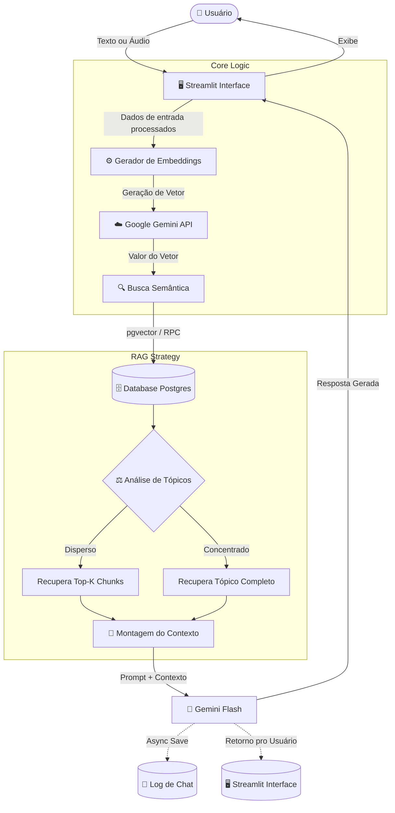
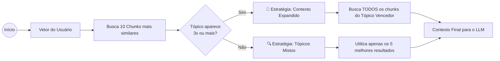
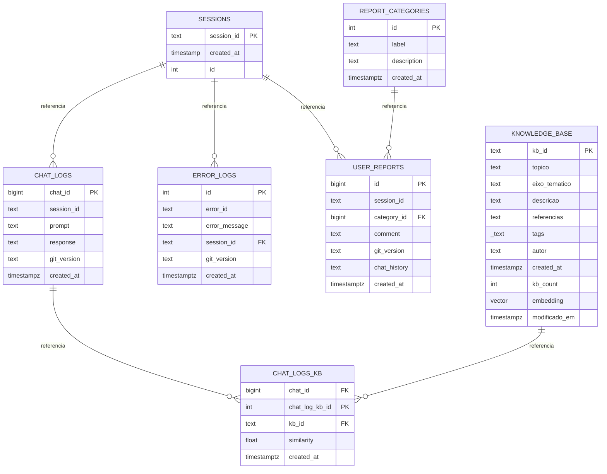

# 🏗️ Arquitetura de Dados e RAG no Vox AI

Este documento detalha a arquitetura técnica do Vox AI, com foco no fluxo de dados, esquema do banco de dados (Supabase) e na estratégia de recuperação de informação (RAG) inteligente.

## 🔄 Fluxo de Execução (Runtime Flow)

O diagrama abaixo ilustra o ciclo de vida de uma interação do usuário, desde a entrada do prompt até a geração da resposta e o log assíncrono.

## 🧠 Lógica de Recuperação Inteligente (Smart RAG)

O Vox utiliza o PostgreSQL com a extensão `pgvector` gerenciado pelo Supabase.

Abaixo estão as principais funções arquiteturais.

## 🗄️ Database Schema (ER Diagram)
O sistema utiliza Supabase (PostgreSQL) com as extensões `vector` e `pg_graphql`.
Abaixo, o diagrama de Entidade-Relacionamento das tabelas principais.

### Detalhe das Tabelas Principais
* `knowledge_base`: O núcleo do conhecimento. Utilizamos índices HNSW na coluna de embedding para performance em escala. Inclui a coluna `kb_count` incrementada via Trigger para métricas de utilidade.

* `chat_logs_kb`: Tabela pivot fundamental para auditoria. Ela conecta uma resposta da IA (`chat_logs`) aos fragmentos exatos de conhecimento (`kb_id`) que foram usados para gerá-la, permitindo rastrear a fonte de possíveis alucinações.

* `user_reports`: Conectada à tabela `report_categories`, permite que usuários classifiquem erros (ex: "Alucinação", "Ofensivo") para posterior análise da curadoria.

## 🔒 Privacidade, Governança e LGPD

O Vox AI foi desenhado seguindo princípios de *Privacy by Design* e em conformidade com a Lei Geral de Proteção de Dados (LGPD). As diretrizes arquiteturais implementadas são:

1. **Row Level Security (RLS) Restrito (Art. 46):** Todas as tabelas transacionais de dados e logs (`chat_logs`, `sessions`, `error_logs`, `user_reports`) são blindadas. Não existem políticas públicas de leitura ou escrita concedidas à `anon_key` pública. A comunicação é realizada pelo backend Streamlit no servidor via chave `service_role` privada.
2. **Minimização de Dados (Art. 6, III):** O envio de relatórios de denúncia restringe a captura do histórico de conversas a no máximo 6 mensagens (3 turnos), armazenando apenas o contexto imediato do incidente.
3. **Descarte Automático e Retenção (Art. 15 e 16):** Um job automático configurado no PostgreSQL via `pg_cron` executa semanalmente a exclusão permanente de registros de logs de chat, erros e sessões com mais de 12 meses de criação.
4. **Direito de Eliminação (Art. 18):** Disponibilizamos a opção de exclusão sob demanda na interface. O acionamento executa um comando de exclusão em cascata (`DELETE`) no banco de dados para todas as referências associadas ao `session_id` atual.

### Stack Tecnológica
* ***Orquestração***: Python 3.13 + Streamlit
* ***Vector Store***: Supabase (`pgvector`)
* ***LLM & Embeddings***: Google Gemini API (`gemini-3-flash-preview` e `gemini-embedding-001`)
* ***CI/CD***: GitHub Actions (Deploy automático de Migrations e Code Review)

---

    
🤖 Vox AI: conversas que importam 🏳️‍🌈

